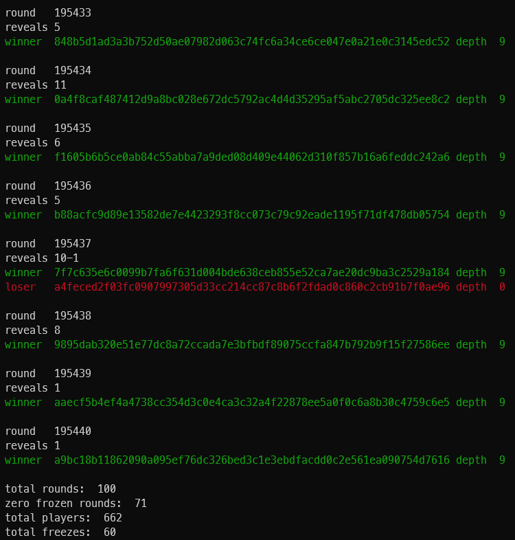

## ReadSI (read storage incentives)

Utilizes the [swarm-scanner](https://swarmscan.io/) to output a human-readable breakdown of the storage incentives.

## Usage

`go run main.go --since=6h --cmd=redistribution|stake|postage|reward`

The `since` flag will output events from the last `since` duration.

### Generate snapshots of all frozen nodes

Capture all frozen nodes in a file.

`go run main.go --since=24h --cmd=redistribution | grep loser | awk '{print $2}' > ./losers.txt`

`cat losers.txt | while read overlay; do curl -s https://api.swarmscan.io/v1/network/nodes/$overlay | jq 'del(.peers)'; done > loser-status.txt`